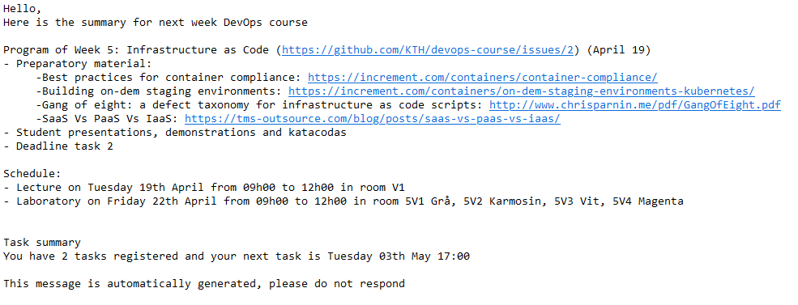

# Summary mail

This action is embedded in the [KTH devops course](https://github.com/KTH/devops-course) and only makes sense to be used in that context.
This action send a scheduled mail to all students with at least one registred tasks with 
- The adviced reading of the next week
- The schedule of the next week (category,time, and location)
- The student's next task deadline

## Example of a mail

## How it works and prerequis 
The action executes the following steps 
- analyzes by matching regular expressions of the **course repo README** to find the weeks'reading, date and the tasks deadlines
- finds the automatic generated **issue on students statistic** ([example of the 2022 issue](https://github.com/KTH/devops-course/issues/1607)) and uses regular expressions to find the number of registerd tasks for each student
- downloads the **course calendar** to expract the main information for each events
- builds the indivdual mail for each student and sends it

This action extracts all the information by matching regular expressions